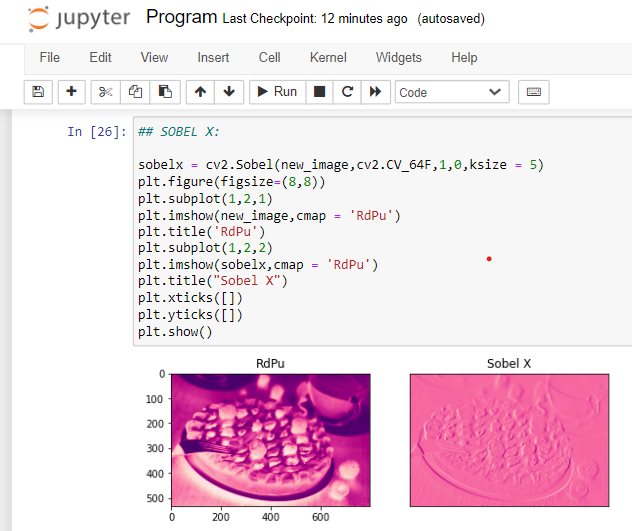
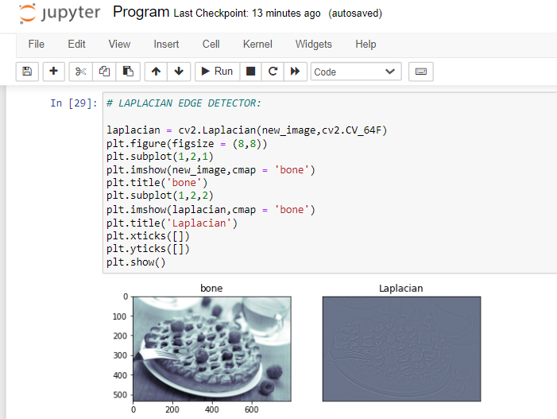

# EDGE-DETECTION
## AIM:
To perform edge detection using Sobel, Laplacian, and Canny edge detectors.

## SOFTWARE REQUIRED:
Anaconda - Python 3.7

## ALGORITHM:
### Step1:
Import the required packages for further process.


### Step2:
Read the image and convert the bgr image to gray scale image.

### Step3:
Use gaussian filter for smoothing the image to reduce the noise.
### Step4:
Apply the respective filters - Sobel, Laplacian edge dectector and Canny edge dector.

### Step5:
Display the filtered image using plot and imshow.

 
## PROGRAM:
Developed by : Swathika G

Register number : 212221230113

### ORIGINAL IMAGE:
```
import numpy as np
import cv2
import matplotlib.pyplot as plt
input_image = cv2.imread("berrypie.jpg")
input_image = cv2.cvtColor(input_image,cv2.COLOR_BGR2RGB)
plt.axis('off')
plt.imshow(input_image)
plt.show()
```
```
gray_image = cv2.cvtColor(image,cv2.COLOR_BGR2GRAY)
new_image = cv2.GaussianBlur(gray_image,(3,3),0)
```
### SOBEL EDGE DETECTOR
### Sobel X:
```
sobelx = cv2.Sobel(new_image,cv2.CV_64F,1,0,ksize = 5)
plt.figure(figsize=(8,8))
plt.subplot(1,2,1)
plt.imshow(new_image,cmap = 'RdPu')
plt.title('RdPu')
plt.subplot(1,2,2)
plt.imshow(sobelx,cmap = 'RdPu')
plt.title("Sobel X")
plt.xticks([])
plt.yticks([])
plt.show()
```

### Sobel Y:
```
sobely = cv2.Sobel(new_image,cv2.CV_64F,0,1,ksize = 5)
plt.figure(figsize = (8,8))
plt.subplot(1,2,1)
plt.imshow(new_image,cmap = 'OrRd')
plt.title('OrRd')
plt.subplot(1,2,2)
plt.imshow(sobely,cmap = 'OrRd')
plt.title("Sobel Y")
plt.xticks([])
plt.yticks([])
plt.show()
```


### Sobel XY:
```
sobelxy = cv2.Sobel(new_image,cv2.CV_64F,1,1,ksize=5)
plt.figure(figsize = (8,8))
plt.subplot(1,2,1)
plt.imshow(new_image,cmap = 'BuPu')
plt.title('BuPu')
plt.subplot(1,2,2)
plt.imshow(sobelxy,cmap = 'BuPu')
plt.title('Sobel XY')
plt.xticks([])
plt.yticks([])
plt.show()
```

### LAPLACIAN EDGE DETECTOR:
```
laplacian = cv2.Laplacian(new_image,cv2.CV_64F)
plt.figure(figsize = (8,8))
plt.subplot(1,2,1)
plt.imshow(new_image,cmap = 'bone')
plt.title('bone')
plt.subplot(1,2,2)
plt.imshow(laplacian,cmap = 'bone')
plt.title('Laplacian')
plt.xticks([])
plt.yticks([])
plt.show()
```


### CANNY EDGE DETECTOR:
```
canny_edge = cv2.Canny(new_image,120,150)
plt.figure(figsize = (8,8))
plt.subplot(1,2,1)
plt.imshow(new_image,cmap = 'gist_gray')
plt.title('gist_gray')
plt.subplot(1,2,2)
plt.imshow(canny_edge,cmap = 'gist_gray')
plt.title('Canny Edges')
plt.xticks([])
plt.yticks([])
plt.show()
```

## OUTPUT:
### ORIGINAL IMAGE:


<br>
</br>

### SOBEL EDGE DETECTOR
### Sobel X:

<br>
</br>

### Sobel Y:

<br>
</br>

### Sobel XY:

<br>
</br>

### LAPLACIAN EDGE DETECTOR:

<br>
</br>

### CANNY EDGE DETECTOR:

## Result:
Thus, the edges are detected using Sobel, Laplacian, and Canny edge detectors.
